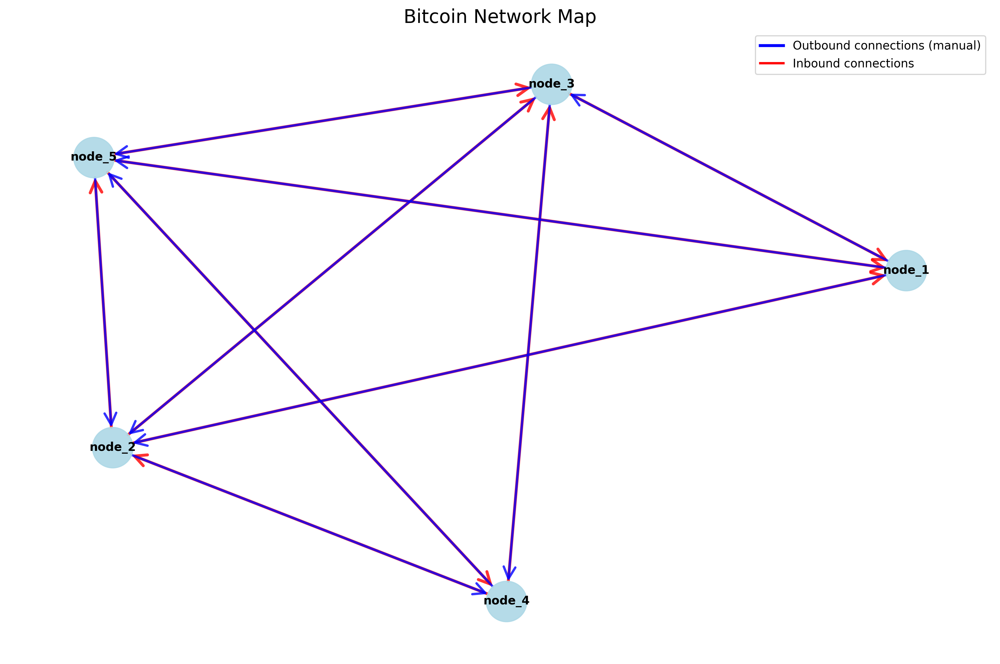

<p align="center">
  <a href="https://www.codefactor.io/repository/github/pallandos/bitcoin-on-local"></a>
  <a href="https://app.deepsource.com/gh/Pallandos/bitcoin-on-local/" target="_blank"></a>
  <a href="https://codecov.io/gh/Pallandos/bitcoin-on-local" ></a>
</p>

# Bitcoin-on-local

- [Bitcoin-on-local](#bitcoin-on-local)
	- [Usage](#usage)
		- [Full usage](#full-usage)
	- [Installation](#installation)
		- [Requirements](#requirements)
		- [Install](#install)
	- [Features](#features)
		- [`bit-cli` : built-in easy CLI](#bit-cli--built-in-easy-cli)
		- [Scenario runner](#scenario-runner)
		- [Network visualization](#network-visualization)
		- [Logging](#logging)


***Bitcoin-on-local*** is a small tool for creating and managing a fully customizable Bitcoin network on your machine. It comes with a modified Bitcoin CLI, logging features, network visualization, and a means to run precise, automated, and directive scenarios. 

See [features](#features) for full descriptions of them.

> ***Bitcoin-on-local*** is based on the amazing [ruimarinho/bitcoin-core](https://github.com/ruimarinho/docker-bitcoin-core) image.

> [!NOTE]
> I built this tool as a way to gain a deeper understanding of the Bitcoin network/technology during my work on blockchain deanonymization using network analysis. It may be incomplete or basic, but feel free to contribute!

## Usage

The first thing you need to do is define your network in `.env`. You can configure everything in there to match your needs. 

> [!NOTE]
> See [configuration doc](./doc/config.md) for complete informations network configuration.


Then, you need to generate the compose of the network with :

```sh
./bitcoin-on-local.sh renew
```

This will create a `docker-compose.yml` in `./docker/` folder. You can edit it if you are not happy with the result, this file will **not** be overwritten by any run. 

To start the network, hit : 

```sh
./bitcoin-on-local.sh start
```

From now on, you can interract with the network using `bitcoin-on-local.sh` to use global commands or use the modified bitcoin CLI to easily interract with a single node.   

### Full usage 

```
Usage: ./bitcoin-on-local.sh start|stop|renew|draw|scenario|draw [output_file]
  start: Start the Bitcoin network with the current configuration.
  stop: Stop the Bitcoin network.
  renew: Generate a new Docker Compose file.
  restart: Restart the Bitcoin network.
  scenario [args]: Use scenario features (see "./bitcoin-on-local.sh scenario -h" for details).
  draw [output_file]: Draw the network topology and save it to output_file (default: img/bitcoin_network_map.png).
```

> [!NOTE]
> The `restart` command uses the `restart` command from Docker compose.

## Installation

### Requirements

This tool requires :

- Docker (compose v2)
- Python (>= 3.12)[^1]

[^1]: The tool may work on older versions but has not been tested on it. 

> [!NOTE]
> Project is beeing tested right now 

All other dependencies will be installed with pip. See [requirements.txt](./requirements.txt).

### Install

1. First, clone or download the repository. 
2. Grant the execution rights to `install.sh` : 

		chmod +x ./install.sh

3. Run the install script :

		./install.sh

4. If the installation is successful, you should see the usage of `./bitcoin-on-local.sh`.

## Features

### `bit-cli` : built-in easy CLI

`bit-cli.sh` is a modified Bitcoin CLI that helps to interract with each node. This script auto-completes the username and password, as well as it does not require the IP of the node, just the name. It aims to interract more easily with the nodes, by just passing a command. 

It only requires the node name as the first argument and any bitcoin-cli arguments after that.

Usage : 

	./bit-cli.sh <node_name> <bitcoin-cli-args>

<details>

<summary> Example usage </summary>

Assuming you have the default `BASE_NAME`, all your nodes will be named `node_1`, `node_2`, `node_3` ...

	./bit-cli.sh node_1 getblockchaininfo

to get blockchain info.

	./bit-cli.sh node_2 getnetworkinfo

for network info.

	./bit-cli.sh node_2 generatetoaddress 11 "myaddress"

to generate 11 blocks, from `node_2` to *myaddress*.

</details>

### Scenario runner

A **scenario** is an automated sequence of actions designed to reproduce the same sequence of events on a Bitcoin network. The main goal of a scenario is to ensure that a specific situation can be replayed identically, making it possible to analyze, test, or demonstrate network behavior in a consistent and repeatable way.

You can write scenarios in a simple language: TOML and run them with a single command. See [scenario](./doc/scenario.md) for full documentation on writing scenarios.

	Usage: bitcoin-on-local.sh scenario [-h] {list,run} [scenario]

	Scenario Runner : run scenarios described in TOML files

	positional arguments:
	{list,run}  Command : list | run
	scenario    Scenario name to run (only required for "run" command)

	options:
	-h, --help  show this help message and exit

<details>

<summary> Example usage </summary>

```sh
./bitcoin-on-local.sh scenario list

>> [INFO ] Using scenario features
>> Available scenarios:
>> scenario2
>> scenario
```

to list all scenarios in the scenario folder. If you want to run a scenario among this list, use :

```sh
./bitcoin-on-local.sh scenario run scenario2
```

This command will print the steps and state of the current scenario.

Example of what is printed to the terminal during the run of a scenario : 

```
[INFO ] Using scenario features
[Scenario] Loaded scenario: scenario
==========================================
Name: My scenario for bitcoin net 

Description: This is an example scenario It will describe in a sequential order some tasks which will be executed by the network.

Written by: Pallandos

Date: 2025-06-10 13:08:00
==========================================
[SCENARIO] Running scenario: My scenario for bitcoin net

[SCENARIO] Step 1/8
Running step: Create wallet (on node: node_1)

[SCENARIO] Step 2/8
Running step: Create address (on node: node_1)
Stored result in variable: ADDRESS1 = bcrt1q9vqtd0vtr75gdsuc8gtx8ku3vqrggn5aqefccd

[SCENARIO] Step 3/8
Running step: Mine some blocks (on node: node_1)

[SCENARIO] Step 4/8
Running step: Create wallet (on node: node_2)

[SCENARIO] Step 5/8
Running step: Create address (on node: node_2)
Stored result in variable: ADDRESS2 = bcrt1qswcy4phya7qx9x0084n9d9dmv39y2nz2m6apee

[SCENARIO] Step 6/8
Running step: send coins (on node: node_1)

[SCENARIO] Step 7/8
Running step: mine to confirm (on node: node_1)

[SCENARIO] Step 8/8
Running step: print balance (on node: node_2)
Result: 
 → 10.0 

[SCENARIO] Scenario execution completed.
```

</details>

### Network visualization

You can get an overview of your network while it is running by the following command :

	./bitcoin-on-local.sh draw [output_file]

where `output_file` is the desired path (default to `img/bitcoin_network_map.png`).

> ***Bitcoin-on-local*** use the Python [networkx](https://github.com/networkx/networkx) module to draw the network graph.

<details>

<summary> Example usage </summary>

Here is the example of a network graph with 5 nodes :



</details>

### Logging

At any time during the run of the network, logs from each node are redirected to `./logs`. You can customize which logging category you want to see in the `data` section of your config file. 

Available categories are now : 

- net 
- tx
- mempool
